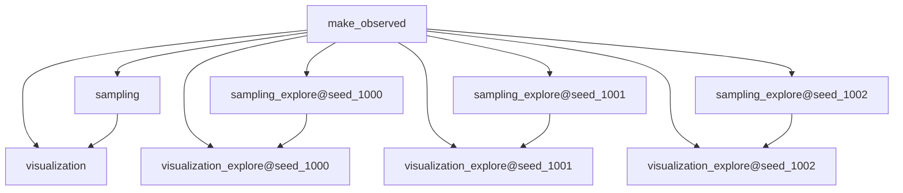
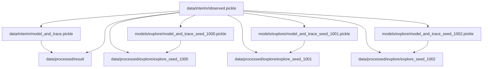

## summary

```mermaid
flowchart TD
	node1["make_observed"]
	node2["sampling"]
	node3["sampling_explore@seed_1000"]
	node4["sampling_explore@seed_1001"]
	node5["sampling_explore@seed_1002"]
	node6["visualization"]
	node7["visualization_explore@seed_1000"]
	node8["visualization_explore@seed_1001"]
	node9["visualization_explore@seed_1002"]
	node1-->node2
	node1-->node3
	node1-->node4
	node1-->node5
	node1-->node6
	node1-->node7
	node1-->node8
	node1-->node9
	node2-->node6
	node3-->node7
	node4-->node8
	node5-->node9
```
## detail

```mermaid
flowchart TD
	node1["data/interim/model_and_trace.pickle"]
	node2["data/interim/observed.pickle"]
	node3["data/processed/explore/explore_seed_1000"]
	node4["data/processed/explore/explore_seed_1001"]
	node5["data/processed/explore/explore_seed_1002"]
	node6["data/processed/result"]
	node7["models/explore/model_and_trace_seed_1000.pickle"]
	node8["models/explore/model_and_trace_seed_1001.pickle"]
	node9["models/explore/model_and_trace_seed_1002.pickle"]
	node1-->node6
	node2-->node1
	node2-->node3
	node2-->node4
	node2-->node5
	node2-->node6
	node2-->node7
	node2-->node8
	node2-->node9
	node7-->node3
	node8-->node4
	node9-->node5
```
