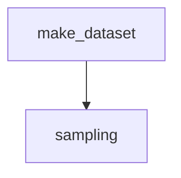
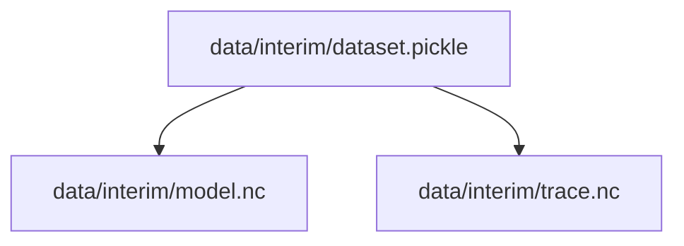

## summary

```mermaid
flowchart TD
	node1["make_dataset"]
	node2["sampling"]
	node1-->node2
```
## detail

```mermaid
flowchart TD
	node1["data/interim/dataset.pickle"]
	node2["data/interim/model.nc"]
	node3["data/interim/trace.nc"]
	node1-->node2
	node1-->node3
```
