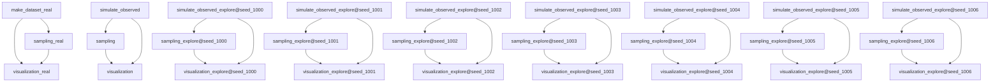
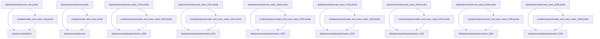

## summary

```mermaid
flowchart TD
	node1["make_dataset_real"]
	node2["sampling_real"]
	node3["visualization_real"]
	node1-->node2
	node1-->node3
	node2-->node3
	node4["sampling"]
	node5["simulate_observed"]
	node6["visualization"]
	node4-->node6
	node5-->node4
	node5-->node6
	node7["sampling_explore@seed_1000"]
	node8["simulate_observed_explore@seed_1000"]
	node9["visualization_explore@seed_1000"]
	node7-->node9
	node8-->node7
	node8-->node9
	node10["sampling_explore@seed_1001"]
	node11["simulate_observed_explore@seed_1001"]
	node12["visualization_explore@seed_1001"]
	node10-->node12
	node11-->node10
	node11-->node12
	node13["sampling_explore@seed_1002"]
	node14["simulate_observed_explore@seed_1002"]
	node15["visualization_explore@seed_1002"]
	node13-->node15
	node14-->node13
	node14-->node15
	node16["sampling_explore@seed_1003"]
	node17["simulate_observed_explore@seed_1003"]
	node18["visualization_explore@seed_1003"]
	node16-->node18
	node17-->node16
	node17-->node18
	node19["sampling_explore@seed_1004"]
	node20["simulate_observed_explore@seed_1004"]
	node21["visualization_explore@seed_1004"]
	node19-->node21
	node20-->node19
	node20-->node21
	node22["sampling_explore@seed_1005"]
	node23["simulate_observed_explore@seed_1005"]
	node24["visualization_explore@seed_1005"]
	node22-->node24
	node23-->node22
	node23-->node24
	node25["sampling_explore@seed_1006"]
	node26["simulate_observed_explore@seed_1006"]
	node27["visualization_explore@seed_1006"]
	node25-->node27
	node26-->node25
	node26-->node27
```
## detail

```mermaid
flowchart TD
	node1["data/interim/observed_real.pickle"]
	node2["data/processed/real"]
	node3["models/model_and_trace_real.pickle"]
	node1-->node2
	node1-->node3
	node3-->node2
	node4["data/interim/observed.pickle"]
	node5["data/processed/result"]
	node6["models/model_and_trace.pickle"]
	node4-->node5
	node4-->node6
	node6-->node5
	node7["data/interim/observed_seed_1000.pickle"]
	node8["data/processed/explore/seed_1000"]
	node9["models/explore/model_and_trace_seed_1000.pickle"]
	node7-->node8
	node7-->node9
	node9-->node8
	node10["data/interim/observed_seed_1001.pickle"]
	node11["data/processed/explore/seed_1001"]
	node12["models/explore/model_and_trace_seed_1001.pickle"]
	node10-->node11
	node10-->node12
	node12-->node11
	node13["data/interim/observed_seed_1002.pickle"]
	node14["data/processed/explore/seed_1002"]
	node15["models/explore/model_and_trace_seed_1002.pickle"]
	node13-->node14
	node13-->node15
	node15-->node14
	node16["data/interim/observed_seed_1003.pickle"]
	node17["data/processed/explore/seed_1003"]
	node18["models/explore/model_and_trace_seed_1003.pickle"]
	node16-->node17
	node16-->node18
	node18-->node17
	node19["data/interim/observed_seed_1004.pickle"]
	node20["data/processed/explore/seed_1004"]
	node21["models/explore/model_and_trace_seed_1004.pickle"]
	node19-->node20
	node19-->node21
	node21-->node20
	node22["data/interim/observed_seed_1005.pickle"]
	node23["data/processed/explore/seed_1005"]
	node24["models/explore/model_and_trace_seed_1005.pickle"]
	node22-->node23
	node22-->node24
	node24-->node23
	node25["data/interim/observed_seed_1006.pickle"]
	node26["data/processed/explore/seed_1006"]
	node27["models/explore/model_and_trace_seed_1006.pickle"]
	node25-->node26
	node25-->node27
	node27-->node26
```
