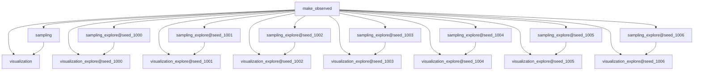
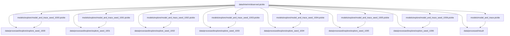

## summary

```mermaid
flowchart TD
	node1["make_observed"]
	node2["sampling"]
	node3["sampling_explore@seed_1000"]
	node4["sampling_explore@seed_1001"]
	node5["sampling_explore@seed_1002"]
	node6["sampling_explore@seed_1003"]
	node7["sampling_explore@seed_1004"]
	node8["sampling_explore@seed_1005"]
	node9["sampling_explore@seed_1006"]
	node10["visualization"]
	node11["visualization_explore@seed_1000"]
	node12["visualization_explore@seed_1001"]
	node13["visualization_explore@seed_1002"]
	node14["visualization_explore@seed_1003"]
	node15["visualization_explore@seed_1004"]
	node16["visualization_explore@seed_1005"]
	node17["visualization_explore@seed_1006"]
	node1-->node2
	node1-->node3
	node1-->node4
	node1-->node5
	node1-->node6
	node1-->node7
	node1-->node8
	node1-->node9
	node1-->node10
	node1-->node11
	node1-->node12
	node1-->node13
	node1-->node14
	node1-->node15
	node1-->node16
	node1-->node17
	node2-->node10
	node3-->node11
	node4-->node12
	node5-->node13
	node6-->node14
	node7-->node15
	node8-->node16
	node9-->node17
```
## detail

```mermaid
flowchart TD
	node1["data/interim/observed.pickle"]
	node2["data/processed/explore/explore_seed_1000"]
	node3["data/processed/explore/explore_seed_1001"]
	node4["data/processed/explore/explore_seed_1002"]
	node5["data/processed/explore/explore_seed_1003"]
	node6["data/processed/explore/explore_seed_1004"]
	node7["data/processed/explore/explore_seed_1005"]
	node8["data/processed/explore/explore_seed_1006"]
	node9["data/processed/result"]
	node10["models/explore/model_and_trace_seed_1000.pickle"]
	node11["models/explore/model_and_trace_seed_1001.pickle"]
	node12["models/explore/model_and_trace_seed_1002.pickle"]
	node13["models/explore/model_and_trace_seed_1003.pickle"]
	node14["models/explore/model_and_trace_seed_1004.pickle"]
	node15["models/explore/model_and_trace_seed_1005.pickle"]
	node16["models/explore/model_and_trace_seed_1006.pickle"]
	node17["models/model_and_trace.pickle"]
	node1-->node2
	node1-->node3
	node1-->node4
	node1-->node5
	node1-->node6
	node1-->node7
	node1-->node8
	node1-->node9
	node1-->node10
	node1-->node11
	node1-->node12
	node1-->node13
	node1-->node14
	node1-->node15
	node1-->node16
	node1-->node17
	node10-->node2
	node11-->node3
	node12-->node4
	node13-->node5
	node14-->node6
	node15-->node7
	node16-->node8
	node17-->node9
```
