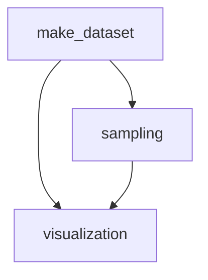
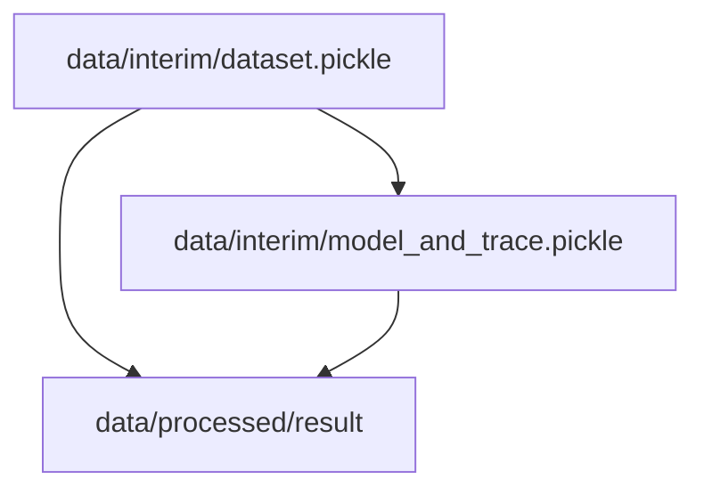

## summary

```mermaid
flowchart TD
	node1["make_dataset"]
	node2["sampling"]
	node3["visualization"]
	node1-->node2
	node1-->node3
	node2-->node3
```
## detail

```mermaid
flowchart TD
	node1["data/interim/dataset.pickle"]
	node2["data/interim/model_and_trace.pickle"]
	node3["data/processed/result"]
	node1-->node2
	node1-->node3
	node2-->node3
```
