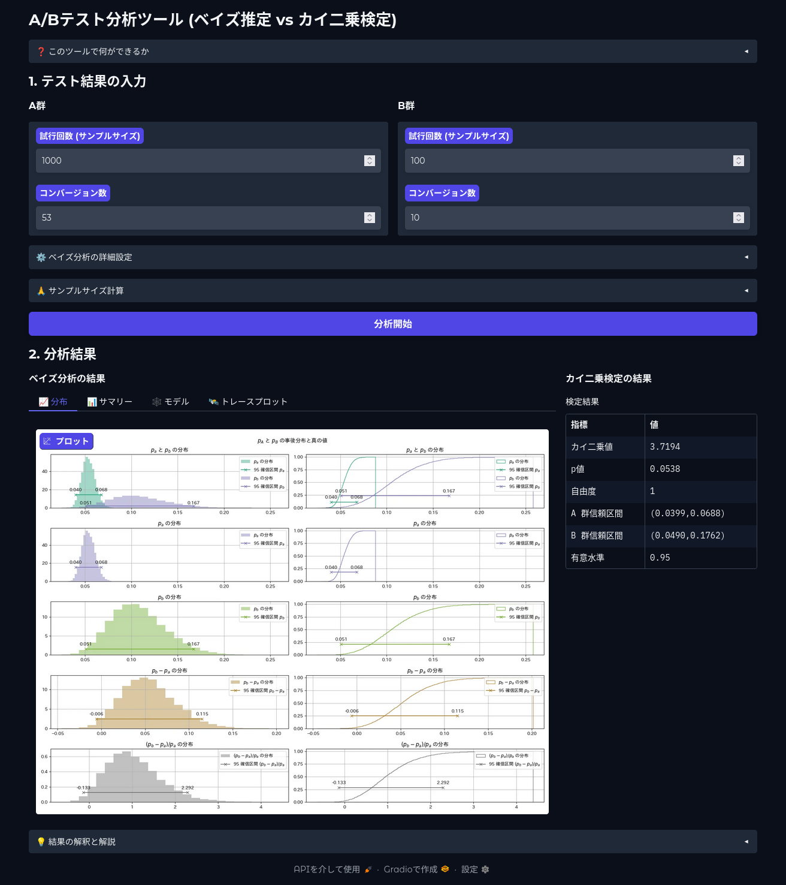

cvr_ab_testing_example
======================

このリポジトリは、A/Bテストの結果をベイズ統計の手法を用いて分析するためのサンプルプロジェクトです。

## このツールについて

Webサイトのコンバージョン率（CVR）改善など、施策Aと施策Bのどちらが優れているかを比較したい場面は多くあります。しかし、単純な比率の比較だけでは、偶然の差なのか、本当に意味のある差なのかを判断するのは困難です。

このツールは、ベイズ推定を用いることで、A/Bテストの結果を確率的に解釈し、より深い洞察を得ることを目的としています。具体的には、各施策の成功率を確率分布として捉え、「BがAを上回る確率は何%か」といった、ビジネス上の意思決定に直結する問いに答えるための情報を提供します。

### 対象読者

- A/Bテストの分析方法を学びたいデータアナリストやマーケター
- Pythonでのベイズモデリングの実装例を知りたいエンジニアや学生
- DVCを用いたデータパイプライン管理の具体的なサンプルを探している方

## 分析手法

A群とB群それぞれを独立したベルヌーイ分布に従う試行とみなし、その成功確率 `p` をベイズ推定します。事前分布には無情報事前分布である `Beta(1, 1)` を用いています。

モデルの構造は以下のDAG（有向非巡回グラフ）で表されます。

- 

## 動作確認環境

- OS: Ubuntu 22.04
- Python: 3.10

インストール方法
----------------


poetry のインストール

```
$ pip install poetry
```

ライブラリのインストール

```
$ git clone https://github.com/u-masao/cvr_ab_testing_example.git
$ cd cvr_ab_testing_example
$ poetry install
```

データの作成
------------

実験結果を CSV ファイルで保存します。

- ファイル保存先: data/raw/observed_real.csv
- ファイル形式: CSV, UTF-8, ヘッダあり
- 試行していない箇所は NULL とする
- 行の関連は見ない(対応のない2群の分析)

```:入力データ例
obs_a,obs_b
1,0
1,0
1,1
0,1
,1
,0
,1
```


実行方法
--------

```
$ poetry run dvc repro visualization_real
```

実行結果
--------

コマンドを実行すると、以下の成果物が生成されます。

- **チャート:** `reports/figures/real/`
  - 各種分析結果のプロットが格納されます。
- **数値データ:** `data/processed/real/`
  - 分析結果のサマリーなどがCSVファイルとして格納されます。

### 結果の例


- **分布プロット**: A群とB群それぞれの成功率（パラメータ `p`）の事後分布を可視化します。これにより、各パラメータがどの範囲にありそうかを確率的に把握できます。
- **確信区間 (HDI)**: パラメータが存在する確率の高い区間を示します。
- **Upliftの分布**: `p_b - p_a` の分布です。0をまたいでいるか、どの程度プラス側にいるかなどから、施策Bの改善効果を判断します。
- **相対Upliftの分布**: `(p_b - p_a) / p_a` の分布です。改善率がどの程度かを確認できます。

## Web UI について

コマンドラインだけでなく、ブラウザ上で手軽に分析を試せるWeb UIも用意しています。

以下のコマンドで起動します。

```
make ui
```

ブラウザで `http://localhost:7860/` にアクセスして下さい。



## コードの構成

このリポジトリは、一般的なデータ分析プロジェクトの構成に準拠しています。主要なディレクトリとファイルは以下の通りです。

```
.
├── data/                # データファイル
│   ├── raw/             # 加工前の生データ (例: observed_real.csv)
│   └── processed/       # 分析結果の数値データ
├── models/              # 学習済みモデルやサンプリング結果
├── reports/             # 分析レポートや可視化結果
│   └── figures/         # プロット画像
├── src/                 # ソースコード
│   ├── data/            # データ作成・加工スクリプト
│   ├── models/          # モデル定義・サンプリングスクリプト
│   ├── visualization/   # 可視化スクリプト
│   └── ui.py            # Gradio Web UI のコード
├── dvc.yaml             # DVCパイプライン定義ファイル
├── params.yaml          # パラメータ定義ファイル
└── README.md            # このファイル
```

- **`src/`**: Pythonのソースコードが格納されています。
  - **`data/make_dataset.py`**: `data/raw` のCSVファイルを読み込み、分析用の形式に変換します。
  - **`models/base.py`**: PyMCによるベイズモデルの定義が記述されています。
  - **`models/sampling.py`**: MCMCサンプリングを実行し、事後分布を生成します。
  - **`visualization/visualize.py`**: サンプリング結果を元に、各種プロットやサマリーCSVを生成します。
  - **`ui.py`**: Gradio製のWeb UIを起動するスクリプトです。
- **`dvc.yaml`**: データ処理から可視化までの一連の処理パイプラインを `dvc` で定義しています。`dvc repro` コマンドは、このファイルに基づいて処理を実行します。
- **`params.yaml`**: パイプラインの挙動を制御するためのパラメータ（例：シミュレーションの乱数シードなど）を定義しています。

